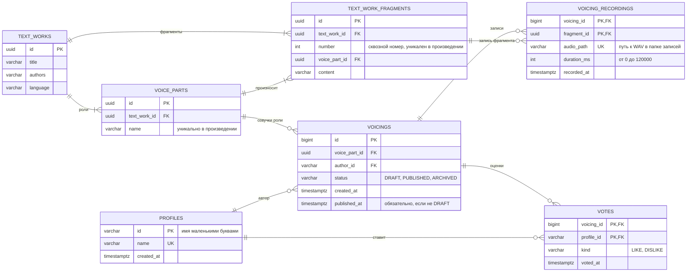

# ER-диаграмма базы данных «Теремка»

Схема — [`schema.sql`](schema.sql), начальные данные — [`seed.sql`](seed.sql).
Основная сущность — `voicings`: озвучка одной роли одним автором.
Картинка для отчёта — [`er-diagram.png`](er-diagram.png), та же схема на доске FigJam рядом с User Story Map.

## Связи и ограничения

| Связь | Тип | Что гарантирует база |
| --- | --- | --- |
| `text_works` → `voice_parts` | один ко многим | имя роли уникально внутри произведения |
| `text_works` → `text_work_fragments` | один ко многим | номер фрагмента уникален внутри произведения и больше нуля |
| `voice_parts` → `text_work_fragments` | один ко многим | фрагмент принадлежит существующей роли |
| `voice_parts` → `voicings`, `profiles` → `voicings` | один ко многим | один автор озвучивает роль один раз: `UNIQUE (voice_part_id, author_id)` |
| `voicings` → `voicing_recordings` | один ко многим | фрагмент записан в озвучке один раз (составной первичный ключ); удаление озвучки удаляет записи |
| `voicings` → `votes`, `profiles` → `votes` | многие ко многим через `votes` | один голос от человека за озвучку (составной первичный ключ); удаление озвучки удаляет голоса |

Статус озвучки ограничен `CHECK`: только `DRAFT`, `PUBLISHED`, `ARCHIVED`, а у опубликованной
или архивной обязательно заполнено `published_at`. Голос — только `LIKE` или `DISLIKE`.
Длительность записи — от 0 до 2 минут, как и лимит записи в приложении.

Сами записи — WAV-файлы на диске (16 кГц, 16 бит, моно). В базе хранится путь к файлу
относительно папки записей (`console-client/data/audio` по умолчанию) и длительность.
